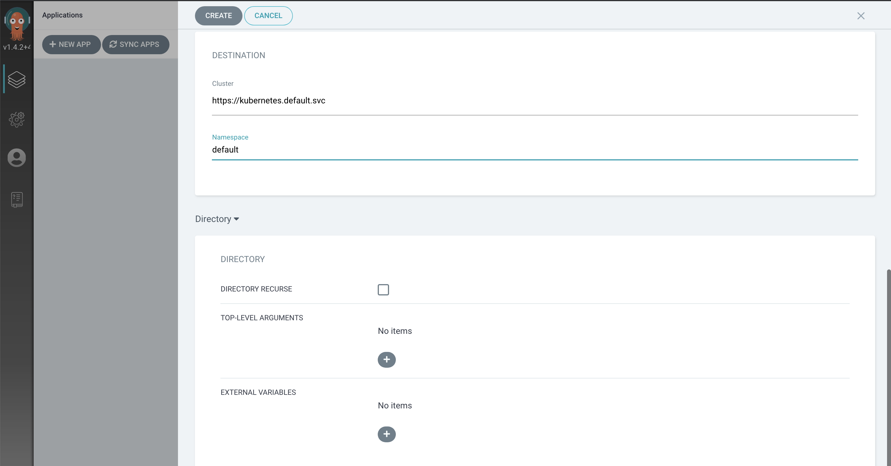

## Pre-requisites

Make sure your environment is setup properly for the lab.

Check the [Environment Setup](../prerequisites/#environment-setup) page for your setup.

## ArgoCD Installation

- Create the namespace `argocd` to install argocd
    ```bash
    kubectl create namespace argocd
    export ARGOCD_NAMESPACE=argocd
    ```
- Create RBAC resources
    ```bash
    kubectl create -n argocd -f https://raw.githubusercontent.com/argoproj-labs/argocd-operator/v0.0.8/deploy/service_account.yaml
    kubectl create -n argocd -f https://raw.githubusercontent.com/argoproj-labs/argocd-operator/v0.0.8/deploy/role.yaml
    kubectl create -n argocd -f https://raw.githubusercontent.com/argoproj-labs/argocd-operator/v0.0.8/deploy/role_binding.yaml
    kubectl create -n argocd -f https://raw.githubusercontent.com/ibm-cloud-architecture/learning-cloudnative-101/master/static/yamls/argo-lab/argo-clusteradmin.yaml
    ```

- Install CRDs
    ```bash
    kubectl create -n argocd -f https://raw.githubusercontent.com/argoproj-labs/argocd-operator/v0.0.8/deploy/argo-cd/argoproj.io_applications_crd.yaml
    kubectl create -n argocd -f https://raw.githubusercontent.com/argoproj-labs/argocd-operator/v0.0.8/deploy/argo-cd/argoproj.io_appprojects_crd.yaml
    kubectl create -n argocd -f https://raw.githubusercontent.com/argoproj-labs/argocd-operator/v0.0.8/deploy/crds/argoproj.io_argocdexports_crd.yaml
    kubectl create -n argocd -f https://raw.githubusercontent.com/argoproj-labs/argocd-operator/v0.0.8/deploy/crds/argoproj.io_argocds_crd.yaml
    ```
    Verify CRDs
    ```bash
    kubectl get crd -n argocd
    ```
    ```
    NAME                        CREATED AT
    applications.argoproj.io    2020-05-15T02:05:55Z
    appprojects.argoproj.io     2020-05-15T02:05:56Z
    argocdexports.argoproj.io   2020-05-15T02:08:21Z
    argocds.argoproj.io         2020-05-15T02:08:21Z
    ```
- Deploy Operator
    ```bash
    kubectl create -n argocd -f https://raw.githubusercontent.com/argoproj-labs/argocd-operator/v0.0.8/deploy/operator.yaml
    ```
- Deploy ArgoCD CO
    ```bash
    kubectl create -n argocd -f https://raw.githubusercontent.com/argoproj-labs/argocd-operator/v0.0.8/examples/argocd-lb.yaml
    ```
    Verify that ArgoCD Pods are running
    ```bash
    kubectl get pods -n argocd
    ```
    ```
    NAME                                                     READY   STATUS    RESTARTS   AGE
    argocd-operator-5f7d8cf7d8-486vn                         1/1     Running   0          3m46s
    example-argocd-application-controller-7dc5fcb75d-xkk5h   1/1     Running   0          2m3s
    example-argocd-dex-server-bb9df96cb-ndmhl                1/1     Running   0          2m3s
    example-argocd-redis-756b6764-sb2gt                      1/1     Running   0          2m3s
    example-argocd-repo-server-75944fcf87-zmh48              1/1     Running   0          2m3s
    example-argocd-server-747b684c8c-xhgl9                   1/1     Running   0          2m3s
    ```
    Verify that the other ArgoCD resources are created
    ```
    kubectl get cm,secret,svc,deploy -n argocd
    ```
- List the argocd-server service
    ```bash
    kubectl get svc example-argocd-server -n argocd
    ```

- From the script, the Argo Server service has a `type` of `LoadBalancer`. If the `ExternalIP` is in a `pending` state, then there is no loadBalancer for your cluster, so we only need the the ArgoCD server's `NodePort`. Otherwise use the `ExternalIP` and `NodePort` to access Argo.
    ```
    NAME                    TYPE           CLUSTER-IP      EXTERNAL-IP     PORT(S)                      AGE
    example-argocd-server   LoadBalancer   10.105.73.245   <pending>   80:31138/TCP,443:31932/TCP   5m3s
    ```

- To access the service we need the `Node's External IP` and the `NodePort`. Let's set an environment variable `ARGOCD_URL` with `NODE_EXTERNAL_IP`:`NodePort`.
    ```bash
    export NODE_EXTERNAL_IP="$(kubectl get nodes -o jsonpath='{.items[0].status.addresses[?(@.type=="ExternalIP")].address}')"
    export ARGOCD_NODEPORT="$(kubectl get svc example-argocd-server -n $ARGOCD_NAMESPACE -o jsonpath='{.spec.ports[0].nodePort}')"
    export ARGOCD_URL="https://$NODE_EXTERNAL_IP:$ARGOCD_NODEPORT"
    echo ARGOCD_URL=$ARGOCD_URL
    ```

- If you can't access the NodePort from your computer and only http/80 then edit the argocd-server and add the flag `--insecure`
    ```bash
    kubectl edit -n argocd deployment example-argocd-server
    ```
    Use the kube api to proxy into the argocd server using `kubectl port-forward`
    ```
    kubectl port-forward service/example-argocd-server 8080:80 -n argocd
    ```
    Then you can access the argocd server locally on port 8080 [http://localhost:8080](http://localhost:8080)

## Deploying the app

- Login using the Browser into the UI using `$ARGOCD_URL` or `localhost:8080` if using port-forward
- Use `admin` as the username and get the password with the following command
    ```bash
    kubectl get secret example-argocd-cluster -n $ARGOCD_NAMESPACE -o jsonpath='{.data.admin\.password}' | base64 -d
    ```
    For example the output is similar to this:
    ```
    tyafMb7BNvO0kP9eizx3CojrK8pYJFQq
    ```


- Now go back to the ArgoCD home and click on `NEW APP`.
- Add the below details:
- Application Name: `sample`
- Project - `default`
- SYNC POLICY: `Manual`
- REPO URL: `https://github.com/ibm-cloud-architecture/cloudnative_sample_app_deploy`
- Revision: `HEAD`
- Path: `kubernetes`


- Cluster - Select the default one `https://kubernetes.default.svc` to deploy in-cluster
- Namespace - `default`
- Click Create to finish



- You will now see the available apps.


- Initially, the app will be out of sync. It is yet to be deployed. You need to sync it for deploying.

To sync the application, click `SYNC` and then `SYNCHRONIZE`.


- Wait till the app is deployed.


- Once the app is deployed, click on it to see the details.


## Verifying the deployment

- Access the app to verify if it is correctly deployed.
- List the cloudnativesampleapp-service service
    ```bash
    kubectl get svc cloudnativesampleapp-service
    ```
    It will have the `NodePort` for the application. In this case, it is `30499`. 
    ```
    NAME                           TYPE       CLUSTER-IP       EXTERNAL-IP   PORT(S)          AGE
    cloudnativesampleapp-service   NodePort   172.21.118.165   <none>        9080:30499/TCP   20s
    ```
- Set an environment variable `APP_URL` using the `Node's IP` and `NodePort` values
    ```bash
    export APP_NODE_PORT="$(kubectl get svc cloudnativesampleapp-service -n default -o jsonpath='{.spec.ports[0].nodePort}')"
    export APP_URL="$NODE_EXTERNAL_IP:$APP_NODE_PORT"
    echo Application=$APP_URL
    ```
- Access the url using `curl`
    ```bash
    curl "$APP_URL/greeting?name=Carlos"
    ```
    ```
    {"id":2,"content":"Welcome to Cloudnative bootcamp !!! Hello, Carlos :)"}
    ```

## References

- [ArgoCD](https://argoproj.github.io/argo-cd/)
